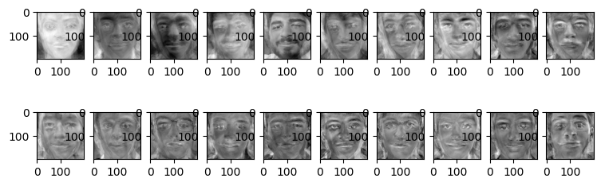

# Final Assignment - Facial Recognition System
The project entails the development of a Facial Recognition System. The system is capable of detecting faces in real-time from video input and identifying them. The system is developed using Python and various ML tools and techniques, including OpenCV, mediaPipe, Principal Component Analysis (PCA), and Support Vector Classifier (SVC).

# Methodologies
- **Face Detection and Cropping**: Done by mediaPipe, which is a robust tool for real-time face detection. It crops the faces from the images, facilitating the removal of irrelevant information, thus ensuring the model focuses solely on faces.

- **Principal Component Analysis (PCA)**: PCA is used for dimensionality reduction while maintaining the essential features. It provides us with Eigenfaces (the principal components of our facial data), which act as a base for face recognition.

- **Support Vector Classifier (SVC)**: Trained with the PCA-processed data, SVC provides an effective face classification mechanism. It uses the Eigenfaces to identify individuals, providing a high level of accuracy.

- **Model Testing**: The system's effectiveness is tested on videos. Whenever a face is detected by mediaPipe, the model predicts the face by cropping it, extracting the Eigenface, and applying the SVC for prediction.

# Pros & Cons of the System
## Pros
1. **Efficient Face Detection**: mediaPipe provides a state-of-the-art method for detecting faces in real time.

2. **Dimensionality Reduction**: PCA efficiently reduces the dimensionality of the data, enabling faster and more efficient computations.

3. **Performance**: The SVC classifier delivers high accuracy in face recognition tasks, making the system reliable and efficient.

4. **Real-Time Analysis**: The system can identify faces in real-time from video input, enhancing its usability in practical applications.

## Cons
1. **Dependent on Light and Angle**: Like most facial recognition systems, changes in lighting and angle can affect the accuracy of face detection and recognition.

2. **PCA Limitations**: PCA assumes that principal components are a linear combination of the original features. If this isn't true, PCA may not provide optimal results.

3. **False Positives**: In video analysis, the model could make false predictions if the face detected is of low quality or partially visible.

# Future Work
- **Improve Robustness**: The system could be made more robust to variations in lighting and face angle by augmenting the training data with artificially varied instances.

- **Advanced Feature Extraction**: While PCA is effective, other feature extraction techniques such as Linear Discriminant Analysis (LDA) or even deep learning methods like convolutional neural networks (CNNs) could potentially improve the performance of the facial recognition system.

- **Another Approach**: Another thought approach was to use [MediaPipe's face mesh](https://developers.google.com/mediapipe/solutions/vision/face_landmarker) to extract facial landmarks and use them as features for classification. Mediapipe model gives a complete mapping of the face, with an estimate of 478 3-dimensional face landmarks. However, this approach was not pursued due to time constraints and the lack of permission to use pre-trained models for this.

- **Application in the Robotics & AI Lab**: An application could be made to use the system in the lab in order to identify students and staff. This could be used to track attendance, monitor lab usage, and more.

# Conclusion
This Facial Recognition System demonstrates the power of combining various ML tools and techniques to solve complex problems. The trade-offs between accuracy and efficiency are managed by integrating PCA and SVC, while real-time face detection is made possible through mediaPipe. However, as with any ML system, there's room for improvement and adaptation to overcome existing limitations.